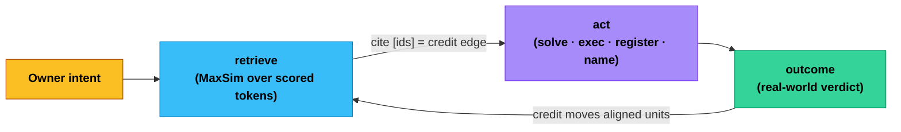

# Accreted Intelligence

*A Recursive Language Model over late-interaction scored-token memory, where judgment lives in external scored state and the model is a replaceable processor.*

> **Status (honest).** This describes **acc**, a working single-host research kernel — a running system, not a roadmap. It is a proof-of-concept built to test one thesis under real use, and it is deliberately precise about what reality has validated, what is self-graded, and what remains open. Where a claim is not yet validated by controlled experiment, it says so.

## Abstract

Large models perform impressive tasks, then forget how they did it. Each session starts near zero: what worked, what failed, and what should be avoided is rarely retained in a form that can *govern* the next decision. The result is intelligence that is generated and discarded rather than intelligence that compounds.

This paper presents **accreted intelligence**: an architecture that moves learning out of model weights and into *scored external state*. Per-token memory, reusable runtimes, owner facts, warnings, commitments, and outcomes persist across sessions, models, and upgrades. The system improves by acting, observing real results, assigning credit to the specific units of memory that aligned with the work, and updating their scores — while the model remains a replaceable processor rather than the locus of intelligence. **acc** is a working kernel for this thesis on a single host. The interface is two verbs over one memory; the discipline that makes it compound is that credit defaults to a weak prior and only reality earns full weight.

## 1. The problem — intelligence that doesn't compound

The central unsolved problem is not generating outputs. It is accumulating *reliable judgment* across time.

A model that scores 90% on a benchmark today scores 90% again tomorrow — not 91%. It does not learn from deployment. It does not track which of its outputs led to good results, nor remember that an approach failed last week. It produces intelligence and immediately throws it away.

This is often mistaken for a memory problem, and treated with retrieval-augmented generation, vector stores, and fine-tuning. But recall is not judgment. Recall returns previously seen information; judgment knows *what worked* — that an approach succeeded here, failed there, holds in this context but not that one. In reinforcement learning this is the **credit assignment problem** (Sutton & Barto 2018): when something goes well, which past decision earns the credit; when it goes wrong, which decision caused it. Deployed systems do not solve this. They emit outputs, observe nothing about consequences, and reset.

Recall is tractable inside current architectures, so the field optimizes recall. But even perfect scored knowledge is inert if consulting it is optional. A model can satisfy its task without ever reading what the system already knows. **The deepest bottleneck is retrieval-to-action binding**: making accumulated judgment behaviorally mandatory rather than passively available. Recall is the easy part. Scoring is harder. Binding scoring to action is the part everyone skips — and it is the part that decides whether intelligence compounds.

## 2. The thesis — accreted intelligence

Consider DNA. It does not think or plan. It is a scored record of what survived contact with reality, accumulated over deep time. Organisms are temporary processors: they express the genome, meet the environment, and either propagate the successful patterns or are eliminated. The information substrate outlives every individual that passes through it. The intelligence is in the genome, not the organism.

Most AI systems invert this: the model is treated as the intelligence and state as supporting material. Accreted intelligence flips it back. The state holds the tested judgment; the model is the transient processor that reads it, extends it, and moves on. The defining properties:

1. **State comes first.** The scored state determines what the system knows, what it avoids, and what it tries next — not the model's momentary disposition.
2. **Reality does the scoring.** Memory rises or falls on observed outcomes, not on what a designer guessed would matter, and not on the system's own confidence. Credit defaults to a weak prior unless reality validated it (§4).
3. **The processor is replaceable.** Intelligence lives in the substrate, so the reasoning model can be swapped without losing what was learned (§5).
4. **Failure is scored knowledge.** Bad outcomes debit the units that aligned and stay retrievable as warnings — not discarded or averaged away. A system that forgets its mistakes becomes overconfident fast.

This matters because reasoning is getting cheaper while judgment is not. If models become interchangeable, the scarce asset is the tested state they work against. The architecture treats reasoning as the renewable input and judgment as the compounding asset.

## 3. The shape of the system

acc reduces the entire reasoner interface to **two verbs**, and binds every non-trivial call to four links: owner intent, the cited memory that shaped the work, the act, and the outcome that closes it. Citation is the credit edge, not decoration — the memory that gets cited is the memory that earns (or loses) score when the outcome lands.

**Two verbs.** `acc_retrieve(query | image)` is the *only* read — it peeks the scored memory by MaxSim, natively multimodal (a text query and an image both encode to late-interaction tokens, so a text memo can answer an image query, ColPali-style). `acc_act(runtime, input)` does anything: `solve` (recurse on a sub-goal), `exec` (run sandboxed code that can itself recurse over the memory), `register` (store reusable named code as scored tokens), `outcome` (close a commitment with a real-world verdict). Any registered runtime is invoked by name. Writing to memory and crediting are *not* verbs — the loop does them automatically on every call.

**Recursion is the only control primitive.** There is no `decompose` operation. When a goal cannot be answered directly, the reasoner `solve`s a sub-goal; the tree those recursive solves grow *is* the decomposition. No planner, no explicit task graph — decomposition emerges. This makes acc a concrete instance of the Recursive Language Model idea (Xu et al. 2025): treat the language model as a step inside a recursive program over an external store, rather than stuffing a long context into one forward pass.

**Late-interaction scored-token memory.** Each entity — a knowledge memo, a runtime, an owner fact, a goal, an image — is stored as an ordered set of per-token vectors. There is no single-vector dense form; the token is the atom. Retrieval ranks by **MaxSim** (Khattab & Zaharia 2020):

$$\text{score}(q, d) = \sum_i \max_j \text{sim}(q_i, d_j)$$

For each query token, take its best-matching document token; sum those bests. The aligned query-token-to-document-token pairs are themselves the citation — relevance is computed by late interaction, not by a lossy pooled embedding. This is published commodity (ColBERT for text; ColPali for vision, Faysse et al. 2024).

What acc adds on top is a learned-evidence reweighting of that score. Each document token carries a Bayesian **Beta(α, β) posterior** (Thompson 1933) summarizing how its past alignments fared: its mean

$$\pi_j = \frac{\alpha_j}{\alpha_j + \beta_j}$$

is *how often* this token's alignments led to good outcomes, and the evidence count $\alpha_j + \beta_j$ is the *confidence* that estimate carries (it grows as reality weighs in). acc extends plain MaxSim by weighting each token's contribution by this posterior:

$$\text{score}(q, d) = \sum_i \max_j \big[\, \text{sim}(q_i, d_j) \cdot g(\pi_j) \,\big]$$

where $\pi_j$ is document token $j$'s Beta posterior and $g$ is a monotonic confidence weighting — a token reality has repeatedly confirmed pulls harder than a fresh one. *(The exact form of $g$ and its calibration are proprietary.)*

**Scored runtimes.** `register` stores code as scored tokens: retrievable by MaxSim, creditable by outcome, improvable by re-registering. There is **no privileged lane** — a runtime is just another scored row plus a sandboxed executor. Inside an `exec` run, code can recurse over the memory programmatically, mapping and filtering the whole substrate in loops without ever loading it into the model's context window. Execution runs in a sandbox with the host network deliberately reachable (so code can call real APIs) and the substrate available read-only for in-sandbox recall.

**Two reasoners over one substrate.** The same memory is read and extended by two distinct reasoning models through the identical two-verb interface — one acts as the owner-class coordinator, one as a second reasoning engine. Each proposes; the substrate scores and promotes; **neither model canonizes its own output.** Self-graded credit from either reasoner is the weak prior until reality validates it.

**Enforcement is structural.** The four-link discipline is not a norm the reasoner is asked to honor — it is wired into the runtime by structural enforcement hooks: retrieval fires on the owner's prompt and is *bound* into the working context (the top operating law: knowledge compounds only when retrieval is behaviorally binding), and an exit guard fails closed when a turn mutated the workspace but recorded no qualifying commitment. The principle: advisory gates are fake; make them hard. The exact hook set and its internals are *(intentionally omitted — proprietary)*.

**Prediction — the substrate models its own dynamics.** Retrieval is perception; the substrate also *predicts*. Every settled act appends one **transition** — a `(state, action, state′)` sample — to a bounded ledger, where the state is the typed appraisal of the work (what is covered, what holes remain). A **nonparametric k-NN over those transitions** predicts which action most reduces the remaining typed residue — *predicted-energy descent* — and that prediction enters action selection as a scored term, never as authority (a candidate whose only predicted gain is in the owner-authority dimension can never auto-fire). This makes acc a Joint-Embedding Predictive Architecture in the practical sense LeCun (2022) frames: each transition also carries a **latent world-state sketch** of the pre-act context, so the predictor matches in a *learned joint-embedding space* rather than on surface features — prediction is over representations, with the encoder frozen (no online training; collapse is precluded structurally by bounded Beta evidence, not by an EMA-teacher trainer). Transitions are tagged **self vs. world**: the predictor of our own controlled dynamics is never contaminated by exogenous change (a page arriving, the world moving under us), and a region's rising prediction error is attributed — *we changed* vs *the world changed* — by counting exogenous arrivals against per-region Brier drift. The predictor stays nonparametric on purpose: a learned forward head is gated behind a measured trigger (k-NN abstention or Brier stagnation), not built speculatively. *(The exact energy weighting, the sketch projection, the drift thresholds, and the calibration constants are proprietary.)*

The result is a small **hierarchy of prediction over one memory, at three timescales**: token-level alignment (MaxSim perception), act-level transition prediction (the k-NN energy term above), and goal/region-level prediction (region-localized routing posteriors and per-region Brier, learned from commitment outcomes). No second model, no separate planner — the same scored substrate, read at three grains.

## 4. Reality-gated credit

A score is only as good as the evidence behind it. The honesty discipline at acc's center is that **the system refuses to compound from its own belief.**

When a commitment closes, credit does not smear across a whole document. It flows to the specific tokens that aligned during retrieval; their Beta posteriors update Bayesian-style — a good outcome adds to a token's α, a bad one to its β, which moves both its mean $\pi_j = \alpha/(\alpha+\beta)$ and its confidence $\alpha+\beta$. The update is **surprise-gated** — an outcome that confirms what a token already predicted moves it little; a surprising one moves it more (free-energy minimization, Friston 2010, applied to practical judgment rather than sensory prediction) — and **reality-gated**, scaled by provenance: an outcome validated by reality (a real reply, a passing test, a world result) carries full weight, while a self-graded outcome contributes only a deliberately weak prior. In general form, the update for an aligned token scales as

$$\Delta \;\propto\; \text{surprise} \cdot \text{provenance weight}$$

bounded so a heavily-credited token stays *correctable* by future opposite evidence rather than pinning at certainty. *(The exact surprise function, the provenance weights, the bound, and the calibration constants are proprietary.)*

The discipline that makes the whole loop trustworthy is this **provenance gate**. Closing a commitment defaults to a *self-graded* provenance, which credits at a deliberately weak prior — so the substrate stops compounding from self-belief. Full-weight credit requires that **reality** validated the outcome: the owner confirmed it, the world replied, a sandboxed run exited cleanly, or a test passed. Prediction is not permission, and a prediction is not a result. This is not a rhetorical norm — it is the default in the schema and the weighting in the credit path, so the system cannot quietly tag its own grade as reality. The principle is the public part; the specific provenance multipliers, the self-graded discount, and the calibration layer are the moat — *(intentionally omitted — proprietary)*.

The Beta posterior (Thompson 1933) is load-bearing precisely because it separates *how often* a unit's alignments led to good outcomes from *how much evidence* backs that estimate: a unit that aligned well 8 of 10 times should outrank one that aligned well 1 of 1, even though both look strong at a glance. The posterior is enforced and measured at the per-unit level; the exact parameterization of $g$ over it is omitted.

## 5. Processor independence

A property acc demonstrates concretely: intelligence is not bound to any one reasoning engine. The scored substrate is read and extended by two different model families through one interface today, and neither owns the judgment — it lives in the state. The reasoning processor is swappable, and demonstrably swapped.

The claim is bounded, on purpose. Processor independence is real *at the interface* — the two verbs, the schema, and the retrieval bindings are model-agnostic. It is **not** a claim of total model neutrality. The **encoder is part of the substrate's identity**: one substrate is pinned to one late-interaction encoder, and changing that pin requires a full re-encode — you cannot mix encoders on one memory. The operating contract also shapes behavior. So the *reasoning* processor is a free variable; the *encoder* and the kernel contract are not.

Processor independence does not imply topology independence either. Multi-agent decomposition can degrade performance on sequential reasoning versus a single capable agent (Kim et al. 2025). acc's recursion is single-reasoner-first: one reasoner tightly bound to the substrate, recursing on sub-goals, delegating to an isolated worker only for implementation. Adding processors adds coordination cost, not judgment.

## 6. Boundaries & frontier

What acc is and isn't, stated plainly:

- **Not a trained foundation model.** acc trains nothing. It is a memory-and-loop kernel around replaceable models. Its intelligence is the scored substrate, not learned weights.
- **Not proof of general competence.** It is a working single-host kernel with promising mechanism-level behavior — not a demonstration of human- or institution-level intelligence.
- **Not proven at scale.** MaxSim over per-token multivectors is exact but grows with the substrate. How far it stays fast and accurate, and what the right approximate-search / pruning regime looks like *without* losing unit-level credit, is open.
- **Self-graded credit is weak and must be labeled.** It credits at a weak prior and is never to be presented as reality. The provenance discipline is only as honest as the evidence chain behind each close — and a self-improving substrate can corrupt its own scoring in subtle ways, so that chain is something to govern, not assume.

The honest open frontier:

- **Proving substrate-on vs. off lift.** The single most important missing experiment: a counterfactual harness running the same tasks with the scored substrate enabled and disabled, measuring the delta. The mechanisms exist and the hypothesis is falsifiable; the controlled measurement does not yet.
- **Proving the predictor earns its place.** The transition predictor, the latent world-state sketches, and the self/world drift split are live and credited — but whether predicted-energy descent measurably improves action selection over a grid-only or no-predictor baseline is not yet shown by controlled experiment. Until it is, the predictor's value is a mechanism-level claim, and the learned forward head stays gated.
- **Credit assignment under concurrent work.** When many isolated workers and two reasoners act in parallel against one substrate, attributing an outcome to the right memory is harder than in a serial loop.
- **Dependable runtime replay.** Turning a successful trace into a runtime that replays *reliably* — not just stored — without re-reasoning each time.
- **Reality-gated, idempotent execution.** Ensuring side-effecting runtimes are safe to retry, and that a re-run does not double-act on the world.
- **Hardening the authority boundary.** A reachable-network sandbox plus owner-credential authority is a real attack surface; the line between "may draft" and "may send" must stay hard as the system touches live accounts.

A system that compounds judgment must invest as heavily in governance, credit honesty, and boundary enforcement as in scoring and accumulation. The substrate must be governed as carefully as the intelligence is grown.

## 7. Conclusion — the bet

An intelligence that resets every session can be useful, but it cannot compound. It keeps paying to rediscover what it should already know.

acc is a bet that this is temporary, reduced to its smallest honest form: **two verbs over one late-interaction scored-token memory**, where credit attaches to the units that aligned, runtimes are scored code with no privileged lane, outcomes are weighted by whether *reality* validated them, and the reasoning processor is replaceable while the substrate persists. The four links are made structural by hard enforcement; the trust-kernel — credit honesty and an owner-authority floor — keeps the system from compounding self-belief or acting beyond consent.

acc demonstrates a *working kernel* for accreted intelligence on a single host. It does not solve intelligence, and it is honest about the gap between its mechanisms (live, scored, running) and its largest claims (substrate-on lift, scale, replay), which remain unproven. The open question is no longer whether this kind of architecture is possible. It is who will build it well, measure it honestly, and govern it carefully.

---

Questions, issues, and discussion: the project channel at
[github.com/maxbaluev/accreted-intelligence/issues](https://github.com/maxbaluev/accreted-intelligence/issues).

## References

**Late interaction & multi-vector retrieval**
- Khattab, O. & Zaharia, M. (2020). "ColBERT: Efficient and Effective Passage Search via Contextualized Late Interaction over BERT." *SIGIR*. [arXiv:2004.12832](https://arxiv.org/abs/2004.12832)
- Santhanam, K. et al. (2022). "ColBERTv2: Effective and Efficient Retrieval via Lightweight Late Interaction." *NAACL*. [arXiv:2112.01488](https://arxiv.org/abs/2112.01488)
- Faysse, M. et al. (2024). "ColPali: Efficient Document Retrieval with Vision Language Models." [arXiv:2407.01449](https://arxiv.org/abs/2407.01449)
- Dhulipala, L. et al. (2024). "MUVERA: Multi-Vector Retrieval via Fixed Dimensional Encodings." [arXiv:2405.19504](https://arxiv.org/abs/2405.19504)

**Recursion, retrieval-augmentation & long context**
- Xu, P. et al. (2025). "Recursive Language Models / Retrieval in Long-context Language Models: An Empirical Study." [arXiv:2512.24601](https://arxiv.org/abs/2512.24601)
- Lewis, P. et al. (2020). "Retrieval-Augmented Generation for Knowledge-Intensive NLP Tasks." *NeurIPS*. [arXiv:2005.11401](https://arxiv.org/abs/2005.11401)

**Credit assignment, Bayesian scoring & active inference**
- Sutton, R.S. & Barto, A.G. (2018). *Reinforcement Learning: An Introduction* (2nd ed.). [book](http://incompleteideas.net/book/the-book-2nd.html)
- Thompson, W.R. (1933). "On the likelihood that one unknown probability exceeds another in view of the evidence of two samples." *Biometrika*. [JSTOR](https://www.jstor.org/stable/2332286)
- Russo, D. et al. (2018). "A Tutorial on Thompson Sampling." *Foundations and Trends in Machine Learning*, 11(1). [arXiv:1707.02038](https://arxiv.org/abs/1707.02038)
- Friston, K. (2010). "The free-energy principle: a unified brain theory?" *Nature Reviews Neuroscience*, 11. [Nature](https://www.nature.com/articles/nrn2787)
- Parr, T., Pezzulo, G. & Friston, K. (2022). *Active Inference: The Free Energy Principle in Mind, Brain, and Behavior*. MIT Press. [MIT Press](https://mitpress.mit.edu/9780262045353/active-inference/)
- LeCun, Y. (2022). "A Path Towards Autonomous Machine Intelligence." *(Joint-Embedding Predictive Architectures; prediction in representation space.)* [OpenReview](https://openreview.net/forum?id=BZ5a1r-kVsf)

**Externalized intelligence & compound systems**
- Clark, A. & Chalmers, D. (1998). "The Extended Mind." *Analysis*, 58(1). [Oxford Academic](https://academic.oup.com/analysis/article-lookup/doi/10.1093/analys/58.1.7)
- Zaharia, M. et al. (2024). "The Shift from Models to Compound AI Systems." [BAIR Blog](https://bair.berkeley.edu/blog/2024/02/18/compound-ai-systems/)
- Kim, S. et al. (2025). "When More is Less: Understanding Multi-Agent LLM Scaling." [arXiv:2512.08296](https://arxiv.org/abs/2512.08296)
